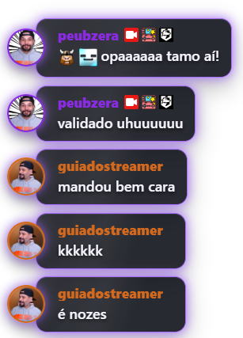

# Neon Persona ✦

### Chat Box Twitch premium e gratuito com avatar do espectador

Chat Box premium, gratuito e exclusivo para **Twitch**, com avatar real do espectador, card escuro com efeito glass, borda e glow configuráveis, nome na cor do usuário, badges e emotes entregues pelo Chat Box e mensagem em uma linha visual separada.

**Uso gratuito** · **Avatar real** · **Twitch-only** · **Badges e emotes nativos** · **Cores fáceis de trocar** · **Não exige Streamlabs Desktop**

[Configuração](#configuração-do-widget) · [Onde funciona](#onde-funciona) · [Personalização](#personalização-rápida) · [Avatar e privacidade](#avatar-e-privacidade) · [Limitações](#limitações-técnicas-reais) · [Licença](LICENSE.txt)

## Teste real do widget



*Captura final validada do widget. Os avatares foram resolvidos corretamente pela DecAPI; badges, emotes, cores dos nomes e mensagens foram preservados pelo Chat Box. O neon permanece nos cards e avatares, enquanto os nomes aparecem limpos, sem fundo ou blur retangular.*

> Criado por Leonardo do Guia do Streamer com ajuda de IA.

| Identificação | Informação |
| --- | --- |
| Projeto | Neon Persona |
| ID de autoria | `GDS-NP-2026-4C1A7E` |
| Autor e responsável pelo projeto | Leonardo — Guia do Streamer |
| Escopo | Chat Box exclusivamente para Twitch |
| Distribuição | Gratuita pelo repositório/publicação oficial |

## Uso gratuito

O Neon Persona pode ser usado gratuitamente em transmissões, gravações e conteúdos próprios, inclusive monetizados ou comerciais. Também é permitido personalizar cores, tamanhos, aparência e código para atender às necessidades da própria transmissão.

Este repositório pode ser público para facilitar o acesso oficial ao widget. O acesso gratuito não coloca o projeto em domínio público e não concede permissão geral para redistribuição externa.

Não é permitido:

- redistribuir os arquivos ou publicar cópias para download fora da publicação oficial;
- revender ou sublicenciar o projeto;
- fazer reupload em sites, drives, grupos, repositórios ou plataformas;
- publicar versões copiadas ou levemente modificadas;
- apresentar o projeto, o código ou o visual como criação própria.

Para compartilhar o projeto, envie o link do repositório ou da publicação oficial do Guia do Streamer em vez de reenviar os arquivos. As funcionalidades de visualização e fork oferecidas pelo próprio GitHub permanecem sujeitas aos Termos de Serviço da plataforma.

O uso do pacote está sujeito à licença gratuita com restrições incluída em [`LICENSE.txt`](LICENSE.txt). Ao usar ou modificar os arquivos, a pessoa concorda em respeitar essas condições.

## Arquivos

| Arquivo | Onde colar |
| --- | --- |
| `neon-persona.html` | Campo **HTML** do Chat Box |
| `neon-persona.css` | Campo **CSS** do Chat Box |
| `neon-persona.js` | Campo **JS** do Chat Box |
| `README.md` | Instruções e condições de uso |
| `LICENSE.txt` | Licença gratuita de uso com restrições |
| `assets/neon-persona-preview.png` | Preview oficial do projeto |

## Identificação de autoria

O identificador deste lançamento é:

```text
GDS-NP-2026-4C1A7E
```

O código curto `4c1a7e` também está inserido discretamente no HTML, CSS e JavaScript. Ele ajuda a relacionar cópias do pacote ao projeto original e ao respectivo lançamento.

O identificador não é DRM, não coleta dados e não altera o funcionamento do widget. Ele também não substitui registro formal de direitos autorais nem impede tecnicamente que alguém copie ou remova trechos do código; sua finalidade é registrar a procedência e reforçar a atribuição correta.

Não remova ou adultere o crédito, o identificador de autoria ou os avisos de licença ao criar uma versão personalizada para uso próprio.

## Configuração do widget

> **Importante:** a Streamlabs é usada aqui como o serviço que gera e hospeda a URL do Chat Box. Você **não precisa transmitir pelo Streamlabs Desktop**. Depois de configurar o widget, a URL pode ser usada no OBS Studio, Streamlabs Desktop, Meld Studio, PRISM Live Studio, StreamYard (por compartilhamento de aba ou câmera virtual) e em outros programas que aceitem URL, link, fonte de navegador ou fonte web.

1. Entre no painel da Streamlabs e abra **Todos os widgets > Chat Box**.
2. Na seleção de plataformas do Chat Box, deixe **somente Twitch** ativada. O código visual não tem como desativar plataformas na configuração da sua conta.
3. Ative a opção de **HTML/CSS personalizado** e abra o editor de código.
4. Substitua o conteúdo do campo HTML pelo conteúdo completo de `neon-persona.html`.
5. Substitua o conteúdo do campo CSS pelo conteúdo completo de `neon-persona.css`.
6. Substitua o conteúdo do campo JS pelo conteúdo completo de `neon-persona.js`.
7. Salve as configurações e teste primeiro pelo painel da Streamlabs.
8. Copie a **URL do widget** gerada no painel.
9. No seu programa de transmissão, adicione uma **Fonte de navegador**, **Browser**, **Browser Capture** ou equivalente e cole a URL. Um ponto de partida confortável é `520 × 700 px`; ajuste conforme a sua cena.

O guia atual da própria Streamlabs para instalar e configurar o widget está em [Como configurar o Chat Box](https://support.streamlabs.com/hc/en-us/articles/52815318480283-How-to-Set-Up-a-Chat-Box-Overlay).

## Onde funciona

O Neon Persona funciona diretamente em programas capazes de carregar uma URL como fonte web. O nome do recurso muda, mas a lógica é a mesma:

| Programa | Como usar |
| --- | --- |
| **OBS Studio** | Adicione **Fonte de navegador / Browser Source** e cole a URL. Consulte a [documentação oficial do OBS](https://obsproject.com/kb/browser-source). |
| **Streamlabs Desktop** | Adicione **Browser Source** e cole a URL. Consulte o [guia oficial da Streamlabs](https://streamlabs.com/content-hub/post/introducing-browser-source-interaction-for-streamlabs-desktop). |
| **Meld Studio** | Adicione uma camada **Browser** ou cole a URL diretamente no canvas. Consulte a [documentação oficial do Meld](https://meldstudio.co/docs/layers/). |
| **PRISM Live Studio** | No Desktop, use **Browser Capture**; no Mobile, use o **Web Browser Widget**. Consulte os guias oficiais do [PRISM Desktop](https://guide.prismlive.com/desktop/guides/getting-started-with-prism-desktop) e [PRISM Mobile](https://guide.prismlive.com/mobile/guides/widgets-and-effects/web-widget/using-web-browser-widget). |
| **StreamYard** | Abra a URL em uma aba do Chrome e use **Apresentar > Compartilhar tela > Aba do Chrome**. Para sobrepor o chat livremente sobre toda a cena, componha antes no OBS e envie o resultado ao StreamYard por câmera virtual. Consulte o [guia oficial de compartilhamento de tela](https://support.streamyard.com/hc/en-us/articles/360043726731-Share-a-Screen). |
| **Outros programas** | Funciona quando o aplicativo aceita uma URL em uma fonte de navegador, fonte web, browser layer ou recurso equivalente. |

No StreamYard, o compartilhamento de uma aba entra como conteúdo apresentado e não oferece o mesmo posicionamento livre de uma Browser Source do OBS. Por isso, a câmera virtual é a opção indicada quando você quer o chat realmente sobreposto ao layout.

## Personalização rápida

No topo de `neon-persona.css`, procure a área:

```css
PERSONALIZE SEU CHAT AQUI
```

Nela você pode alterar, sem procurar regras espalhadas pelo arquivo:

- cor geral do tema em uma única variável;
- cor da borda e do glow separadamente, se quiser um ajuste avançado;
- fundo do card;
- tamanho e raio do avatar;
- raio do card;
- tamanho do nome;
- tamanho da mensagem;
- espaçamento interno e entre mensagens.

Para trocar o tema inteiro, altere somente `--cor-principal`:

```css
--cor-principal: #ff3bd4; /* rosa */
```

Outros exemplos prontos: azul `#32b7ff`, verde `#52e89b` e vermelho `#ff4d67`.

## Mostrar ou ocultar o avatar

No começo de `neon-persona.js`, altere esta chave:

```js
const MOSTRAR_AVATAR = true;
```

- `true`: mostra o avatar e consulta a DecAPI;
- `false`: remove o espaço do avatar e não faz consultas à DecAPI.

## O que continua sendo nativo do Chat Box

O projeto mantém o elemento `#log`, o template `chatlist_item`, os atributos `data-from` e `data-id`, os placeholders nativos e o contêiner `.badges`. O JavaScript não recria nem intercepta as mensagens: ele observa o item que o serviço de Chat Box já inseriu e adiciona somente o avatar.

Por isso, permanecem sob responsabilidade do Chat Box:

- recebimento e inserção das mensagens;
- cor do nome enviada no placeholder `{color}`;
- badges/distintivos fornecidos no payload do Chat Box;
- emotes processados pela Streamlabs;
- remoção/moderação de mensagens pela classe nativa `.deleted`;
- tempo de ocultação definido na configuração do widget e aplicado pelo placeholder `{message_hide_delay}`.

Ative badges, emotes de terceiros e o tempo de ocultação desejado nas configurações do próprio Chat Box. O visual preserva o que a Streamlabs efetivamente entregar, mas não pode fabricar um badge ou emote ausente no payload.

## Avatar e privacidade

Para resolver a foto, o widget envia à DecAPI **somente o username público da Twitch** presente na mensagem:

```text
https://decapi.me/twitch/avatar/{username}/
```

A resposta de texto contém a URL pública do avatar da Twitch. O widget não envia a mensagem, badges, ID da conta, token, e-mail nem qualquer credencial à DecAPI.

O resultado válido fica em cache por username durante toda a sessão do widget. Se a mesma pessoa enviar várias mensagens, todas reutilizam a consulta já concluída. Quando uma consulta falha, o widget tenta novamente de forma controlada e guarda a falha por apenas alguns segundos, evitando tanto o bloqueio permanente do avatar quanto uma sequência excessiva de requisições.

Consulte também a [documentação da DecAPI](https://documentation.decapi.dev/) e a página oficial sobre [cache dos endpoints](https://documentation.decapi.dev/cached-endpoints/).

## Limitações técnicas reais

1. **A DecAPI é externa.** Se estiver fora do ar, lenta, limitada, mudar o formato da resposta ou deixar de aceitar requisições do ambiente web usado pelo widget, o avatar real não aparecerá. A mensagem continua normalmente com um fallback circular usando a inicial do username.
2. **Há limites e cache no serviço.** A documentação da DecAPI informa limite geral de `100` requisições a rotas Twitch por `60` segundos por IP e cache de aproximadamente `30` minutos para avatar. Em um chat com muitos usuários inéditos, o limite pode ser atingido; uma troca recente de avatar também pode demorar a aparecer.
3. **A foto chega de forma assíncrona.** Em uma primeira mensagem, o fallback pode aparecer por um instante antes de a imagem terminar de carregar.
4. **Twitch-only depende da seleção no painel.** O template renderiza as mensagens que o Chat Box entregar. Para garantir exclusividade Twitch, desative as demais plataformas nas configurações do widget.
5. **Badges, emotes, exclusões e entrega dependem da Streamlabs/Twitch.** O projeto preserva a mecânica recebida, mas não controla indisponibilidades, mudanças de payload, filtros de moderação ou falhas dos serviços.
6. **Follow, sub, bits e raid não são alertas deste projeto.** Nenhuma dessas notificações foi implementada aqui. Configure-as separadamente no **Alert Box** da Streamlabs caso queira exibi-las.
7. **O teste final precisa ocorrer na sua conta.** Arquivos locais não recebem eventos reais da Twitch. Use o teste do painel e depois confirme com mensagens, badges e moderação reais antes da primeira live.

## Teste recomendado antes da live

- Envie mensagens com duas contas Twitch diferentes.
- Repita mensagens com a mesma conta e confirme que o avatar reaparece.
- Teste uma mensagem com emote e outra de uma conta com badge.
- Exclua uma mensagem pela moderação para confirmar que ela some do overlay.
- Defina um tempo curto de ocultação temporariamente e confirme o fade de saída.
- Desative `MOSTRAR_AVATAR`, salve e confirme o layout sem foto.
- Volte ao tempo de ocultação e tamanho de fonte usados na sua cena antes da live.

## Escopo

Este pacote personaliza somente o **Chat Box da Twitch**. Ele não é um Alert Box, não substitui o chat da Twitch e não cria eventos que a Streamlabs não entregar.
